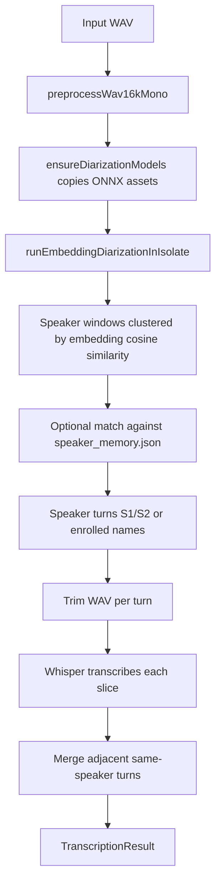

# AI Systems

## AI System Inventory

The repository contains four major AI systems:

- Whisper speech-to-text.
- Speaker diarization and speaker recognition.
- Local LLM generation using a GGUF model through `fllama`.
- YouTube transcript fetching, which is not generative AI but feeds transcript knowledge into the same app surfaces.

## Whisper Transcription

Implementation:

- Service: `lib/whisper_service.dart`.
- Package: `whisper_flutter_new`.
- Bundled model: `assets/models/whisper/ggml-tiny.bin`.
- Optional downloadable models: tiny, base, small, medium from `https://huggingface.co/ggerganov/whisper.cpp/resolve/main/`.
- Default fallback: if no model is selected, the service copies bundled tiny model to application support and uses it.

Runtime options:

- `language`: defaults from `pref_default_lang`, or `auto`.
- `isTranslate`: controlled by `pref_translate_to_english`.
- `isNoTimestamps`: generally false.
- `splitOnWord`: true.
- `diarize`: usually false for per-segment transcription because custom diarization handles speaker labels.

Why it exists:

Whisper converts audio slices into text locally. The app wraps it so all sources, recordings/imports/video imports, converge on one speech-to-text abstraction.

## Diarization And Speaker Recognition

Implementation files:

- `lib/transcript/transcription_compute.dart`
- `lib/transcript/isolated_embedding_diarization.dart`
- `lib/speaker_embedding.dart`
- `lib/model_bootstrap.dart`
- `lib/debug/speaker_memory.dart`
- `lib/onboarding/enroll_flow.dart`

Models/assets:

- Segmentation: `assets/models/segmentation/model.onnx`.
- Optional int8 segmentation path referenced: `assets/models/segmentation/model.int8.onnx`, but not present in the file list.
- Embedding: `assets/models/embedding/nemo_en_titanet_small.onnx`.

Pipeline:



Speaker matching:

- Enrollment stores multiple prototypes per speaker name.
- Matching uses cosine similarity.
- Default match threshold in enhanced diarization call is `0.67`.
- Generic speaker labels remain when no enrolled speaker passes threshold.

Why it exists:

Whisper can produce text, but useful meeting transcripts need speaker boundaries. The custom embedding diarization layer solves speaker attribution and allows known-speaker names.

## Local LLM

Implementation:

- `lib/llm_service.dart`
- `lib/qwen_model_service.dart`
- Package: `fllama`.

Model:

- Filename: `granite-4.0-350m-Q4_K_M.gguf`.
- URL: `https://huggingface.co/ibm-granite/granite-4.0-350m-GGUF/resolve/main/granite-4.0-350m-Q4_K_M.gguf?download=true`.
- Stored under app documents `models/`.
- Download task ID: `enyx_model_download`.

Important naming note:

The code uses Qwen names and a Qwen chat template, but downloads an IBM Granite GGUF model. This may be intentional compatibility, leftover naming, or a technical mismatch to review.

Generation settings:

- Context size constant: `qwenMaxContext = 32768`.
- `numGpuLayers = 99`.
- Default chat temperature: `0.7`.
- Summary/QA temperature: `0.3`.
- Typo fix temperature: `0.0`.
- Frequency penalty: `0.5`.
- Presence penalty: `0.6`.
- Top-p: `0.95`.

## Prompt Systems

### General Chat System Prompt

Purpose: concise local assistant.

```text
You are a concise AI assistant. Keep responses brief and relevant to the conversation context.
```

### Prompt Rewrite System Prompt

Purpose: improve user prompts.

```text
You rewrite and enhance the user's prompt while preserving its original intent. Make it clearer, more specific, and more effective for an AI assistant.
```

### Summary Prompt

Purpose: produce meeting summaries.

The summary prompt asks for:

- Overall summary.
- Key decisions.
- Action items with owners when mentioned.
- Risks and open questions.
- A maximum word count.
- No extra content beyond the summary.

Long transcripts use a hierarchical strategy:

1. Split transcript into 1200-word chunks.
2. Summarize each chunk into about 180 words.
3. Merge chunk summaries into one final streamed summary.

Why this exists:

Local LLM context windows and generation quality degrade with very long transcripts. Chunk-then-merge reduces context pressure and gives the user live output only for the final answer.

### Transcript Q&A Prompt

Purpose: answer only from transcript.

Rules include:

- Only use transcript information.
- If absent, say: `I don't know based on the transcript.`
- Keep the answer concise and direct.

Why this exists:

This reduces hallucination and makes the feature safer for meeting records.

### Typo Fix Prompt

Purpose: clean obvious speech-to-text errors without rewriting.

Rules include:

- Fix only obvious typos/misspellings/wrong ASR words.
- Do not change grammar, structure, tone, or meaning.
- Preserve punctuation and line breaks as much as possible.
- Return only corrected transcript text.

Background typo correction also has a TSV-specific prompt requiring the model to preserve speaker/start/end columns and line count.

Why this exists:

It allows post-ASR cleanup while protecting transcript fidelity.

## AI State Persistence

- Summaries persist in `TranscriptSummaryEntity`.
- Transcript chat persists in `TranscriptChatMessageEntity`.
- General AI chat persists in `AiChatMessageEntity`.
- Speaker memory persists in `speaker_memory.json`.
- Downloaded GGUF model persists in app documents.
- Whisper models persist in app support.

## AI Privacy Posture

Current local AI features do not require sending audio/transcript text to a cloud LLM. Network use is mainly:

- Downloading models.
- YouTube transcript API.
- Optional report/email functions.
- Purchase verification.

## AI Risks And Gaps

- Qwen template plus Granite model naming may indicate prompt-template/model mismatch.
- Summary report service in `TranscriptSummaryPage` uses `YOUR_BASE_URL_HERE`, unlike other pages using `https://enyx.app`.
- `debugPrint('Qwen prompt: $qwenPrompt')` can log full user prompts/transcripts in development logs.
- Typo-fix model output is parsed defensively, but local LLMs can still ignore TSV constraints.
- The app has both ObjectBox speaker entities and JSON speaker memory; active matching uses JSON, which creates two possible speaker-storage concepts.

