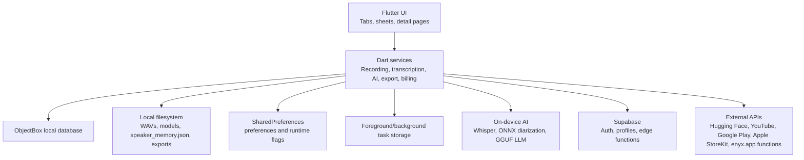
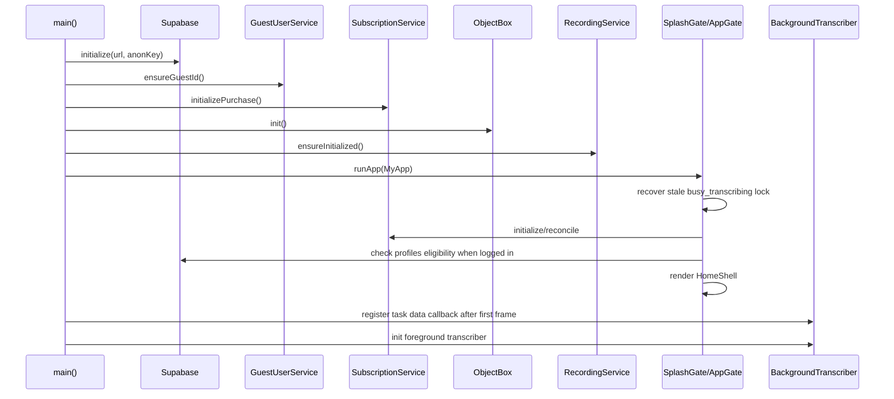

# Architecture

## Architectural Style

The app is a local-first Flutter application with a thin cloud control plane.

## Layers

### Presentation Layer

Key modules:

- `lib/main.dart`: app bootstrap and global theme.
- `lib/home_shell.dart`: main tab shell and access lock overlay.
- `lib/tabs/timeline_tab.dart`: transcript list and quick actions.
- `lib/tabs/search_tab.dart`: search surface.
- `lib/tabs/favourites_tab.dart`: favorite transcripts.
- `lib/calendar/calendar_page.dart`: date-based transcript view.
- `lib/tabs/ai_chat_tab.dart`: general AI chat.
- `lib/tabs/account_tab.dart`: account and subscription UI.
- `lib/settings/settings_page.dart`: preferences and utility pages.
- `lib/transcript/*_page.dart`: transcript detail, summary, chat, YouTube, editor pages.
- `lib/transcript/*_sheet.dart` and `lib/record/record_sheet.dart`: modal action flows.

### Domain/Service Layer

Key modules:

- `RecordingService`: captures microphone audio and sends runtime updates.
- `BackgroundTranscriber`: runs transcription in foreground task context and sends result payloads back to main isolate.
- `transcription_compute.dart`: core audio preprocessing, diarization, Whisper transcription, and turn merging.
- `WhisperService`: model selection/download and Whisper transcribe calls.
- `QwenModelService`: GGUF download and persisted task restoration.
- `LLMService`: isolate-based local LLM execution and prompt formatting.
- `AudioConverterService`: converts imported audio/video to WAV.
- `TranscriptPorter`: ZIP export/import.
- `DocumentExportService`: document sharing/export.
- `SubscriptionService`: purchase, restore, reconcile, and entitlement application.
- `ReportService` and `TranscriptMailService`: outbound support/report/email calls.

### Persistence Layer

Key storage mechanisms:

- ObjectBox for entities and relations.
- SharedPreferences for flags and settings.
- Foreground task key/value storage for cross-isolate/service runtime state.
- Local filesystem for audio files, model files, speaker memory JSON, and exports.
- Supabase Postgres for account profiles and purchase token locks.

## Boot Sequence

Why this ordering exists:

- Supabase must be ready before auth/eligibility and billing verification can work.
- ObjectBox must be initialized before timeline/detail/chat pages read local data.
- Recording/foreground task initialization must happen before the user starts recording or background callbacks arrive.
- Background transcriber callback registration happens after UI start to avoid blocking launch while still catching task results.

## Navigation Architecture

The app uses standard Flutter `Navigator` routes plus modal bottom sheets.

Primary shell:

- `HomeShell` contains an indexed stack of tabs.
- Bottom navigation has Timeline, Calendar, Record action, Search, Favorites.
- Record is an action, not a tab.
- Eligibility lock overlay can disable the app for ineligible non-iOS users.

Quick actions from Timeline:

- Enroll Voice.
- People.
- YouTube Transcript.
- Audio File.
- Video File.
- Phone Call, currently coming soon.

## Concurrency Architecture

The app uses multiple execution contexts:

- Main isolate: UI, ObjectBox writes, most app logic.
- LLM isolate: `LLMService` spawns `LLMIsolate` for local model generation.
- Foreground task isolate/service: Android recording and transcription.
- iOS direct recording path: avoids foreground task service for recording but emits compatible updates.
- Isolated diarization: `runEmbeddingDiarizationInIsolate` keeps speaker embedding work off the UI thread.
- Background downloader: model downloads persist and report progress through `background_downloader`.

Why concurrency is necessary:

- Whisper, diarization, and LLM generation are CPU/GPU-heavy.
- Long recordings/imports must survive UI navigation.
- Model downloads should continue/recover across app restarts.
- UI remains responsive while streaming AI output.

## Current vs Planned Architecture

Current:

- Local ObjectBox is the source of truth for transcript content.
- Supabase is mostly account and entitlement infrastructure.
- YouTube transcripts are local records linked by `youtubeMetaId`.
- Speaker memory is split: ObjectBox has speaker entities, but the active matching path uses JSON file memory under `speaker_memory.json`.

Planned or implied:

- `sourceType` comment says future sources can be added beyond voice and YouTube; audio/video imports already use `2` and `3`.
- `TranscriptionJobEntity` has status/stage/chunk fields that imply richer resumable job tracking than the current foreground-task flow uses.
- Login page contains commented email/password, Google, and Apple flows, suggesting account UX is under revision.
- Phone Call quick action is explicitly “Coming Soon”.
- YouTube metadata has `title` and `channel` fields marked for later video info fetching.

