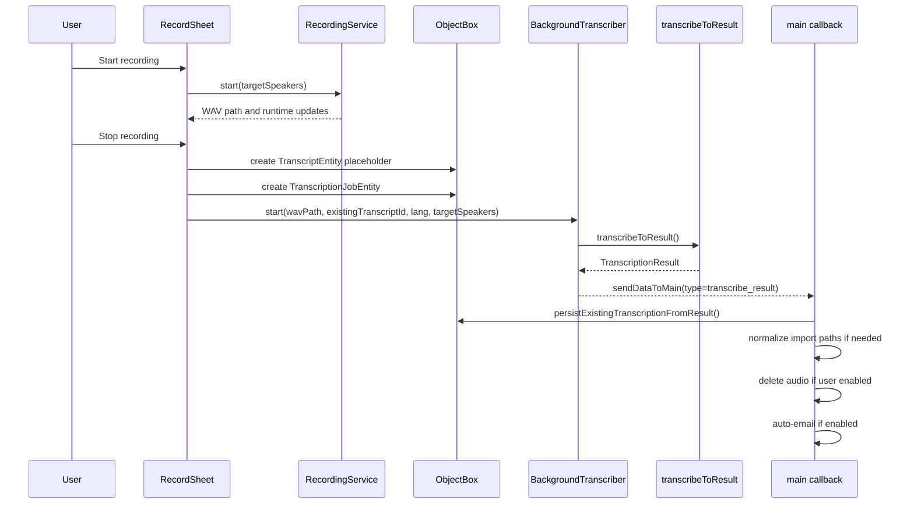
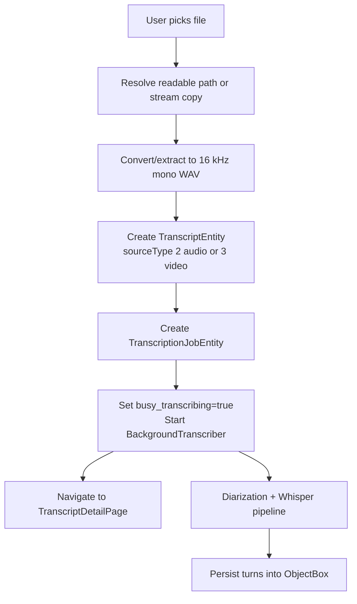
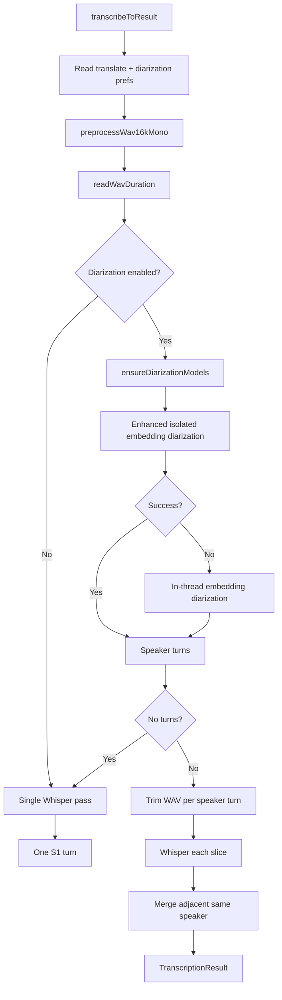
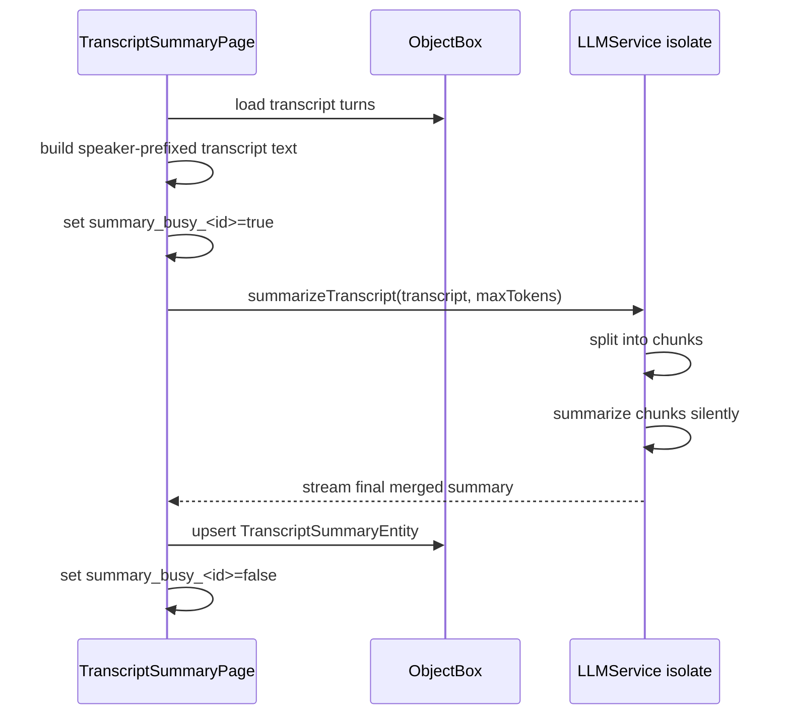
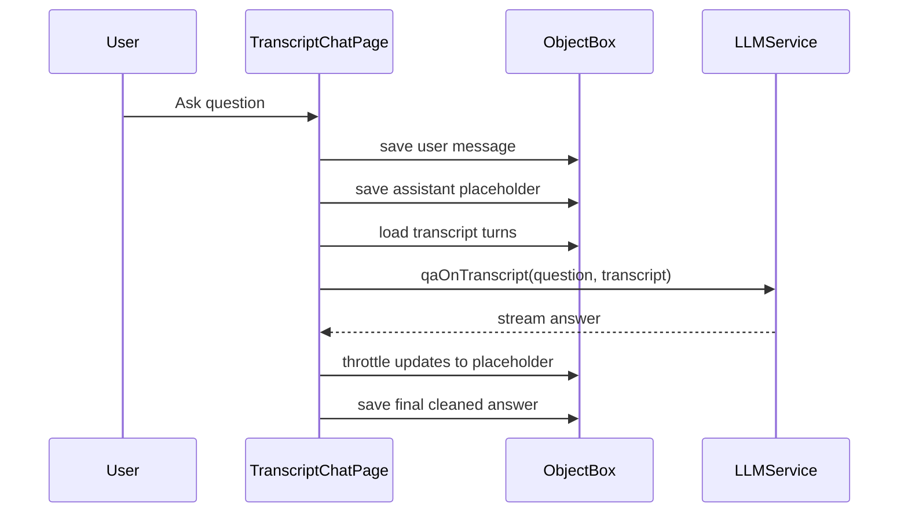
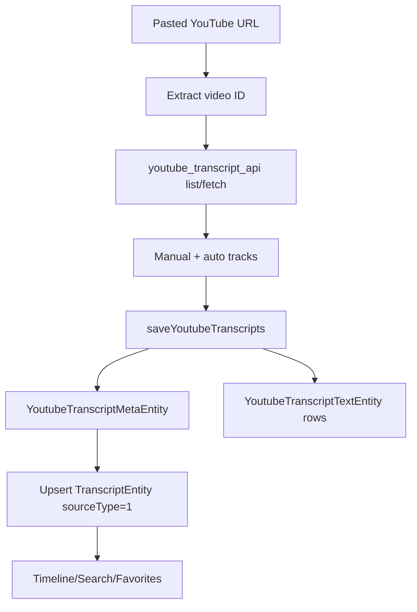
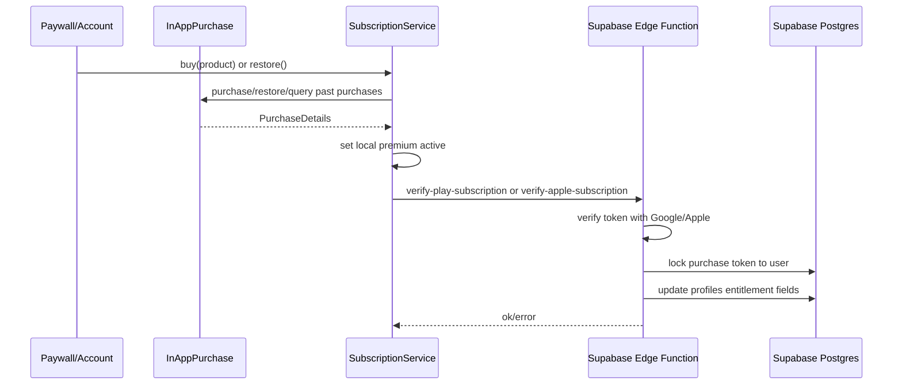

# Data Flow

## Recording-To-Transcript Flow

Why this flow exists:

The app creates a transcript row before transcription completes so the user can see progress immediately, navigate to the detail page, and recover from background processing delays.

## Import Audio/Video Flow

## Transcription Compute Flow

## Summary Flow

## Transcript Q&A Flow

## YouTube Flow

## Billing Flow

Why local unlock happens before server result:

The app prioritizes not blocking the purchaser if server verification is slow or temporarily failing. Remote eligibility still matters for account-level access and cross-device validation.

## Report And Auto Email Flow

- `AutoEmailService.sendIfEnabled` checks `pref_auto_email_transcript` and per-transcript sent flags.
- It builds transcript text and posts to `https://enyx.app/.netlify/functions/send-transcript-txt`.
- `ReportService.sendReport` posts report payloads to `https://enyx.app/.netlify/functions/send-report-transcript`.

Why this exists:

These flows support workflow automation and quality/support feedback without making cloud storage the primary transcript system.

