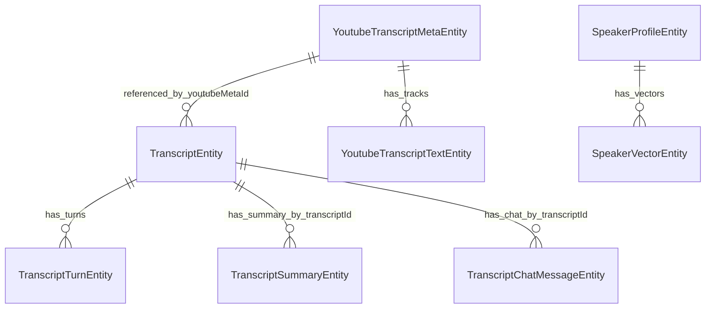

# Database

## Local Database: ObjectBox

ObjectBox is initialized by `ObjectBox.init()` and opened with generated `openStore()`. It is the local source of truth for app content.

## Entity Relationship Overview

## `TranscriptEntity`

Purpose:

The parent record for every saved item in the timeline, including recordings, YouTube transcripts, audio imports, and video imports.

Fields:

- `id`
- `title`, indexed.
- `model`
- `lang`
- `audioPath`
- `processedAudioPath`
- `durationSec`
- `editedText`
- `fullTextCache`
- `searchText`, indexed.
- `createdAt`
- `sourceType`, indexed.
- `youtubeMetaId`, indexed.
- `isFavourite`, indexed.
- `updatedAt`
- `isDeleted`, indexed.
- `deletedAt`

Source types:

- `0`: voice recording.
- `1`: YouTube.
- `2`: audio import.
- `3`: video import.

Current/planned note:

The entity comment says `0 = voice, 1 = youtube (future: add more sources)`. Audio and video sources have already been added in code using `2` and `3`.

## `TranscriptTurnEntity`

Purpose:

Stores individual speaker-attributed transcript segments.

Fields:

- `id`
- Relation to `TranscriptEntity`.
- `speakerLabel`
- `startSec`
- `endSec`
- `text`

Why it exists:

Turn-level storage enables speaker editing, transcript chat context construction, export formatting, and playback alignment.

## `TranscriptionJobEntity`

Purpose:

Tracks background transcription jobs and their state.

Fields:

- `id`
- `wavPath`
- `translateToEnglish`
- `titleHint`
- `status`, indexed.
- `stage`, indexed.
- `totalChunks`
- `processedChunks`
- `currentChunkIndex`
- `isRecording`, indexed.
- `transcriptId`
- `error`
- `createdAt`
- `updatedAt`

Statuses documented in code:

- `PENDING`
- `RECORDING`
- `RUNNING`
- `DONE`
- `ERROR`

Current state:

Jobs are created for record/import flows and updated to `RUNNING` or `ERROR`, but the richer chunk progress fields suggest a planned or partially implemented job-management model.

## `TranscriptSummaryEntity`

Purpose:

Stores one summary per transcript.

Fields:

- `id`
- `transcriptId`, indexed.
- `summary`
- `updatedAt`

Design note:

The comment says the app can reuse `transcriptId` as the entity ID, but the actual upsert uses the existing ObjectBox entity ID when present or `0` for insert.

## `TranscriptChatMessageEntity`

Purpose:

Stores per-transcript Ask AI messages.

Fields:

- `id`
- `transcriptId`, indexed.
- `isUser`
- `text`
- `createdAt`

## `AiChatMessageEntity`

Purpose:

Stores global AI chat tab history.

Fields:

- `id`
- `isUser`
- `text`
- `createdAtMs`

## `YoutubeTranscriptMetaEntity`

Purpose:

Stores metadata for a fetched YouTube video transcript bundle.

Fields:

- `id`
- `videoId`, unique.
- `inputUrl`
- `canonicalUrl`
- `title`
- `channel`
- `createdAtMs`
- `updatedAtMs`

Planned note:

`title` and `channel` are marked as optional fields for later video info fetching.

## `YoutubeTranscriptTextEntity`

Purpose:

Stores each manual or auto-generated YouTube transcript track.

Fields:

- `id`
- Relation to `YoutubeTranscriptMetaEntity`.
- `language`
- `languageCode`
- `isGenerated`
- `text`
- `fetchedAtMs`

## `SpeakerProfileEntity` And `SpeakerVectorEntity`

Purpose:

ObjectBox schema for speaker profiles and vector storage.

Fields in `SpeakerProfileEntity`:

- `id`
- `name`
- `nameKey`, indexed and unique.
- Backlink `vectors`.
- `createdAt`
- `updatedAt`

Fields in `SpeakerVectorEntity`:

- `id`
- Relation to `SpeakerProfileEntity`.
- `embedding` as raw Float32 bytes.
- `createdAt`

Current state:

The active enrollment/matching code uses `lib/debug/speaker_memory.dart`, which stores speaker prototypes in `speaker_memory.json`. These ObjectBox speaker/vector entities may be legacy, planned, or used by other paths not dominant in the current pipeline.

## Remote Database: Supabase Postgres

Referenced tables:

- `profiles`
- `purchase_token_locks`

`profiles` is used for eligibility. `purchase_token_locks` is used by edge functions to prevent token reuse across accounts.

## Soft Delete And Cascade Behavior

Delete from timeline:

- Sets `isDeleted = true`.
- Sets `deletedAt`.
- Updates `updatedAt`.

Purge:

- Items older than three days in trash are permanently deleted.
- For non-YouTube transcripts, the code deletes audio file, turns, summaries, and chat messages.
- For YouTube transcripts, it deletes YouTube text rows and meta row.
- Then it removes the `TranscriptEntity`.

